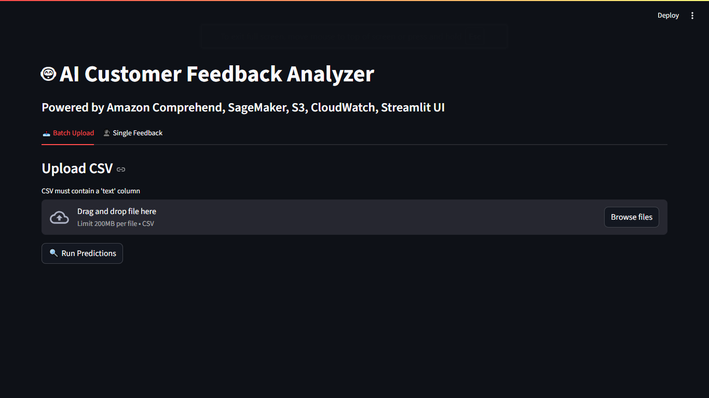

# 🧠 AI Customer Feedback Analyzer (Sentiment Classifier)



This project implements an **end-to-end** **AI-powered Customer Feedback Analyzer** built with **AWS AI Services** and **custom ML workflows**.\
It classifies customer reviews into **Positive, Negative, or Mixed** using **Amazon Comprehend**, **custom-trained SageMaker
model**, **S3**, **CloudWatch**, and a custom **Streamlit UI**, intergrated with **Python (sklearn, pandas, seaborn, boto3)**


This project demonstrates cloud-native ML deployment while also leveraging local developments for **EDA**, **preprocessing** and **testing**
<br/>

##### 📊 Architecture diagram


------------------------------------------------------------------------

#### 📂 Project Structure
##### local VS Code:

    ai-feedback-analyzer/
    ├── data/
    │   ├── reviews.csv                 # Raw dataset (downloaded from Kaggle)
    │   ├── feedback_samples.csv        # Test dataset
    │   ├── train_data.csv              # Training dataset (prepared for SageMaker)
    │   ├── val.csv                     # Validation dataset
    │
    ├── scripts/
    │   ├── upload_to_s3.py             # Upload files to S3
    │   ├── comprehend_analysis.py      # Sentiment & key phrase analysis with Amazon Comprehend
    │   ├── prepare_training_data.py    # Converts Comprehend results to train/val CSVs
    │   ├── sagemaker_training.ipynb    # SageMaker training + deployment steps
    │   ├── train.py                    # Training script for SageMaker
    │   ├── inference.py                # Endpoint deployment script
    │   ├── sagemaker_inference.py      # Test predictions via endpoint locally
    │   └── visualize_results.ipynb     # EDA + model results visualization (seaborn, matplotlib)
    │
    ├── app/
    │   └── app.py                      # Streamlit frontend UI
    │
    ├── requirements.txt                # Dependencies
    └── README.md                       # Project Documentation

##### Sagemaker Notebook (AWS Console):
    sagemaker-notebook/
    ├── data/
    │   ├── train_data.csv 
    │   ├── val.csv
    │
    ├── sagemaker_training.ipynb        #trains model, saves to S3
    ├── inference.py                    #Deploys endpoint
    ├──train.py

##### S3 Buckets folder structure
- `S3://grey-customer-feedback-analyzer/input/`→ raw datasets (reviews.csv, feedback_samples.csv)
- `S3://grey-customer-feedback-analyzer/processed/`→ reviews-analysis.csv
- `S3://grey-customer-feedback-analyzer/training/data/`→ train_data.csv, val.csv  after model training
- `S3://grey-customer-feedback-analyzer/models/`→ trained model artifacts
- `S3://grey-customer-feedback-analyzer/results/`→ model_predictions.csv 
------------------------------------------------------------------------

#### 🔑 Key AWS Services Used

-   **Amazon S3** → Storage for datasets, training data, and model
    artifacts\
-   **Amazon Comprehend** → Initial sentiment & key phrase analysis\
-   **Amazon SageMaker** → Model training, deployment, and endpoint
    hosting\
-   **Amazon CloudWatch** → Logs for model inference and application
    monitoring\
-   **IAM Roles & Policies** → Secure access between services\
-   **Boto3 SDK** → Python scripts to interact with AWS services

------------------------------------------------------------------------

### 📝 Project Workflow

#### 1. Data Collection & Preprocessing

-   Raw dataset (`reviews.csv`).
-   Performed **EDA (Exploratory Data Analysis)** and **data cleaning**
    in **local Jupyter Notebook**.
-   Saved cleaned dataset to `reviews.csv` and uploaded to **S3**.


------------------------------------------------------------------------

### 2. Data Ingestion (S3 + Boto3)

-   Used `upload_to_s3.py` to upload datasets (`reviews.csv`,
    `feedback_samples.csv`) to **S3 input folder**.\
-   Configured **IAM role & permissions** for secure access.


------------------------------------------------------------------------

### 3. Sentiment Analysis with Amazon Comprehend

-   Ran `comprehend_analysis.py` locally in VS Code.\
-   Used **Amazon Comprehend** to detect sentiment + extract key
    phrases.\
-   Saved results to `reviews_analysis.csv` in **S3** and locally.


------------------------------------------------------------------------

### 4. Preparing Training Data for SageMaker

-   Executed `prepare_training_data.py`.\
-   Mapped **Comprehend sentiment → numeric labels**.\
-   Generated `train_data.csv` and `val.csv` for SageMaker training.


------------------------------------------------------------------------

### 5. Model Training & Deployment in Amazon SageMaker

Inside **SageMaker Notebook Instance**:

1.  **Cell 1** → Upload training data to S3 (`data/` folder).\
2.  **Cell 2** → Run `train.py` → Train model (e.g., Linear Learner,
    XGBoost), which pulls training data from S3.
    -   Saves trained model to **S3 bucket models folder**.\
3.  **Cell 3** → Run `inference.py` → Deploy model as a **real-time
    endpoint** and automatically model in new bucket.
    
_Upload training data to S3:_

_Train model:_

_Deploy model:_

_Sagemaker saved model in S3 bucket_


------------------------------------------------------------------------

### 6. Model Testing & Inference (optional, for local)

-   Locally tested endpoint using `sagemaker_inference.py`
-   Used `feedback_samples.csv` for predictions.\
-   Saved results locally & in **S3**.


------------------------------------------------------------------------

### 7. Streamlit Web Application

-   Built `app.py` using **Streamlit**.\
-   Features:\
    ✅ Upload full CSV of feedback for batch predictions\
    ✅ Enter single feedback text for real-time prediction\
    ✅ Interactive visualizations (bar charts, tables)\
    ✅ Stylish minimal UI with AI-themed background vibes\
    ✅ Results saved to S3 & CloudWatch logs


_Batch predictions_:
<p float="left">


</p>

_Single prediction_:


------------------------------------------------------------------------

### 8. Results Visualization (EDA & Model Comparison)

-   In `visualize_results.ipynb | sagemaker_training.ipynb cell 4` (SageMaker Notebook):
    -   Loaded predictions from **S3**.
    -   Visualized using **pandas, seaborn, matplotlib**.


------------------------------------------------------------------------

### 9. CloudWatch Integration

-   Model inference logs automatically stored in **CloudWatch**.\
-   Monitored request/response logs for debugging & auditing.


------------------------------------------------------------------------

### 🧼 Cleanup Checklist

To avoid costs:\
- \[ \] Stop & delete SageMaker notebook instance\
- \[ \] Delete deployed endpoint\
- \[ \] Remove unused S3 data and model artifacts\
- \[ \] Monitor billing in AWS Console

------------------------------------------------------------------------

### ⚙️ Setup Instructions

1.  Clone repo:

    ``` bash
    git clone https://github.com/your-username/ai-feedback-analyzer.git
    cd ai-feedback-analyzer
    ```

2.  Install dependencies:

    ``` bash
    pip install -r requirements.txt
    ```

3.  Configure AWS credentials (IAM user with S3, Comprehend, SageMaker,
    CloudWatch access):

    ``` bash
    aws configure
    ```

4.  Run scripts step by step (see workflow above).

5.  Launch Streamlit app:

    ``` bash
    streamlit run app/app.py
    ```

------------------------------------------------------------------------

## 💰 Cost-Saving Tips

-   Use **AWS Free Tier** whenever possible.
-   Shut down SageMaker endpoints & notebooks when not in use.

-   Keep datasets small (few MBs).

------------------------------------------------------------------------

## 📌 Highlights

-   End-to-end AI pipeline with **AWS + Python**\
-   Combines **Comprehend & Custom Model** for robust classification\
-   Real-time predictions via **SageMaker Endpoint**\
-   Clean, professional **Streamlit UI**\
-   Integrated monitoring with **CloudWatch**

------------------------------------------------------------------------

## 🏆 Outcome

The system can **classify customer feedback** into **Positive, Negative,
or Mixed** with:\
- Automated ingestion → analysis → classification → visualization\
- Cloud-native + cost-optimized architecture\
- A **project** I have enjoyed in learning more about AWS AI/ML services.

------------------------------------------------------------------------
##### 👨‍💻 Author

###### 🤗 My GitHub’s got commits. My blog’s got charisma 😏

<a href="https://greystack.hashnode.dev" target="_blank">
  <svg width="220" height="30" viewBox="0 0 260 32" xmlns="http://www.w3.org/2000/svg">
    <defs>
      <!-- Gradient for badge background -->
      <linearGradient id="badgeGrad" x1="0%" y1="0%" x2="100%" y2="100%">
        <stop offset="0%" stop-color="#08627eff" />
        <stop offset="100%" stop-color="#3d056bff" />
      </linearGradient>
      <!-- Path for animated border -->
      <path id="borderPath" d="M8,0 H252 A8,8 0 0 1 260,8 V24 A8,8 0 0 1 252,32 H8 A8,8 0 0 1 0,24 V8 A8,8 0 0 1 8,0 Z" />
      <!-- Gradient for border stroke -->
      <linearGradient id="glowGrad" x1="0%" y1="0%" x2="100%" y2="0%">
        <stop offset="0%" stop-color="#b8f0ffff" />
        <stop offset="100%" stop-color="#6aff45ff" />
      </linearGradient>
    </defs>
    <!-- Gradient background -->
    <rect width="260" height="32" rx="8" fill="url(#badgeGrad)" />
    <!-- Text label -->
    <text x="130" y="21" text-anchor="middle" fill="#ffffff" font-family="Verdana" font-size="14">
      ☁️ greystack - code, cloud, AI⚡
    </text>
    <!-- Animated border stroke -->
    <path d="M8,0 H252 A8,8 0 0 1 260,8 V24 A8,8 0 0 1 252,32 H8 A8,8 0 0 1 0,24 V8 A8,8 0 0 1 8,0 Z"
          fill="none" stroke="url(#glowGrad)" stroke-width="3"
          stroke-dasharray="1000" stroke-dashoffset="0">
      <animate attributeName="stroke-dashoffset" values="1000;0" dur="3s" repeatCount="indefinite" />
    </path>
  </svg>
</a>


###### 📲 Feel free to connect or drop feedback on [Aubrey T Dube LinkedIn](https://www.linkedin.com/in/aubrey-t-dube-194896288/),  [GitHub](https://github.com/greytyler) or [Email](mailto:aubreytdube19@gmail.com)


